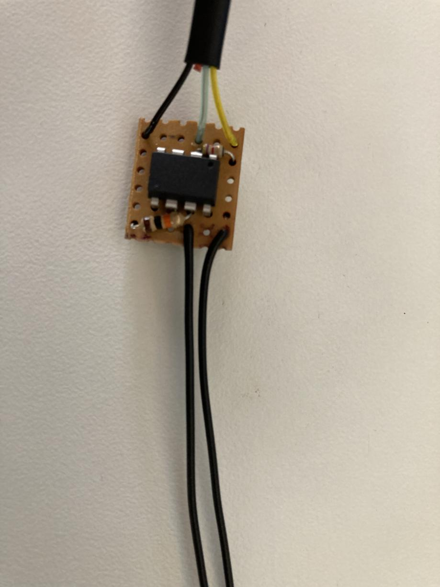
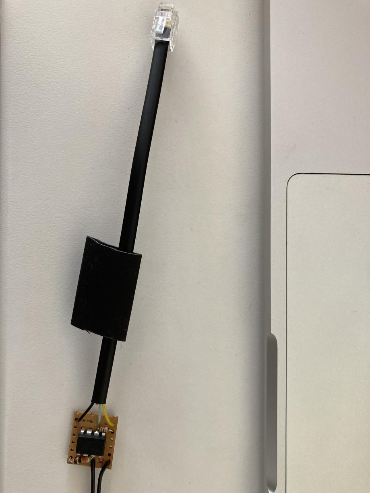
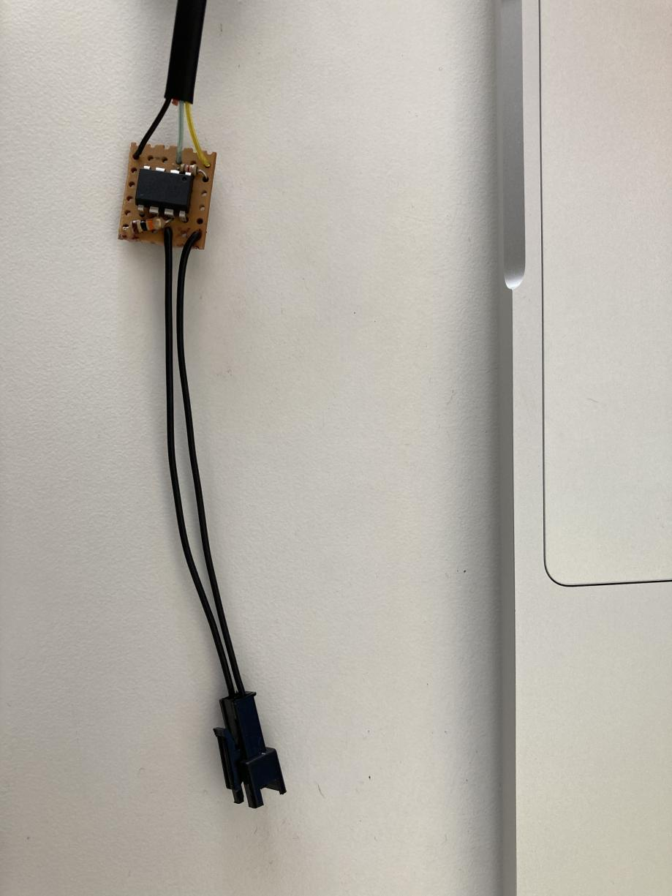
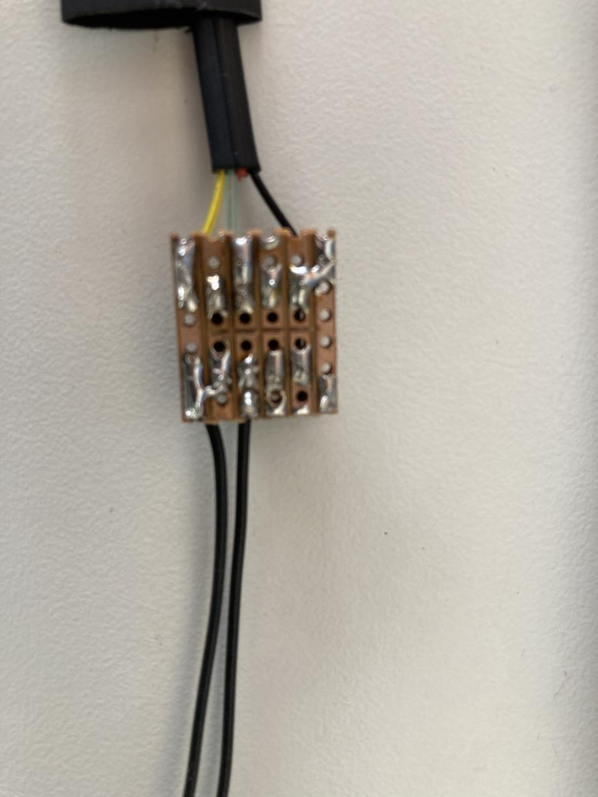

# geyserwise-1wire
An ATTiny firmware for an interposer between an analog geyserwise thermostat, and a digital Sonoff relay

This firmware is intended to run on an ATTiny85 (or other hardware at your own risk!), and read the
analogue thermistor in a Geyserwise thermostat, and make the value available over the OneWire protocol
used by the Sonoff THR320 (and possibly other smart relays).

This is the most sane solution I could come up with, given the constraints:

1. The digital pin of the RJ9 connector is connected to GPIO25 of the ESP32. This pin is in the ADC2
   group, and as a result, is unusable if the WiFi is active. Not terribly useful for an IoT device!
   In other words, it is not possible to simply treat the GPIO as an analogue pin, and read the 
   voltage from a resistor divider.
   1. It might be possible to turn the WiFi off before taking a reading, and turn it back on afterwards,
   but this seemed like an unreliable hack.
   2. It might be possible to add a jumper wire between GPIO25 and another pin in the ADC1 cluster, 
      but the ESP32's footprint is super tiny, and this is likely to cause problems, or be difficult.
2. Ideally don't modify the hardware at all to avoid invalidating warranty protection.
3. Ideally don't modify the ESP32 firmware either, so those less inclined to fight IoT battles can
   avoid the difficulty of flashing ESPHome onto the board. See [this post](https://community.home-assistant.io/t/bootloop-workaround-for-flashing-sonoff-th-elite-thr316d-thr320d-and-maybe-others-with-esphome-for-the-first-time/498868) in
   the HomeAssistant forum for some workarounds. I ended up configuring my ESP32 in `ap:` mode, and
   configuring the WiFi credentials for my home network via the `captive_portal:` to work around the
   rebooting.

Pictures in the images/ directory show how I put it together, on a 6x6 strip of VeroBoard, but please
feel free to do it any way you prefer! I should probably have used an 8x6 strip, because I ended up
putting the resistor wires in the same holes as the ATTiny85 pins! Programming was done using an
ArduinoISP sketch, using the command line in the platformio.ini configuration file.

NB: See this note in the  to get the ATTiny running at the right clock speed! It won't work otherwise!

There is a ground "rail" running down the left hand side of the VeroBoard, and a Vcc "rail" running down
the right hand side. The bluey wire is the digital data line (in this case, connected to GPIO25 in the
Sonoff THR320). The resistor attached to the blue wire is the required pull up according to the OneWire
spec, but may not be strictly required since we are providing Vcc separately. The 10k resistor at the
bottom of the image is making a resistor divider, so that the ATTiny85 can read the resulting voltage.

This picture is intended to show the pinout for the RJ9 connector to the Sonoff THR320.

This picture shows the connector to the Geyserwise thermostat. It doesn't really matter which way around
it is connected, since a thermistor is not polarised.

This picture shows the jumpers from the ground rail to the ATTiny85 Gnd pin, and similarly for Vcc. It
also shows the cut tracks between the pins of the ATTiny85.
